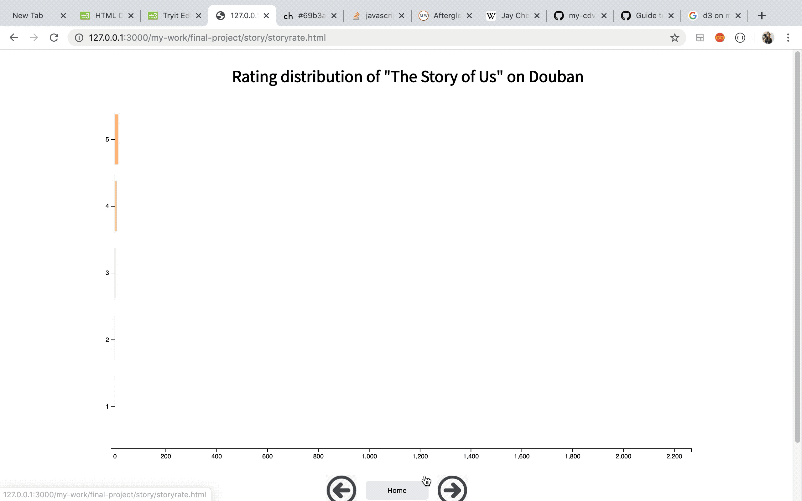

# What happened after they were released?

## Introduction

This project explores the stories of four popular Chinese songs after they were released, which are "The Story of Us" by JJ Lin, "Won't Cry" by Jay Chou,"Dawn" by Kris Wu, and "The Rivals" by Evan Lin.I collected the data and studied the performance of these four songs on two Chinese mainstream music/online discussion platforms, "QQ Music" and "Douban".

  

QQ Music is one of the biggest online music platforms in China.
With the prevalence of digital music and rising awareness of music copyright, many songs in
current music market are not for free - users need to buy the songs on QQ music
to listen to them. QQ music have different awards for a song
according to the sales amount.
In this project, I collected the progress achievements of the four songs and analyzed the data
according to the timelines.

  

Douban is one of the biggest online communities in China. People like to share their views
toward music, films, social phenomenons...etc. Douban Music is particularly for online discussions of different
songs. Users are able to rate the music (from 1 point to 5 point), and write comments under certain music source.
In this project, i collected the rating distribution of the four songs, as well as
the number of comments and 
content in the comments to show users' views toward the four songs.

## Home Page

  

The home page is a collection of the introduction of all four songs. When the user hovers on the images, introduction of that song shows up. The div box at the bottom left is a brief introduction of the song, and the one at the bottom left is an introduction of the singer's background & awards. The user can also listen to the songs by clicking the play/pause button.

Clicking on the images will redirect to the progress achievement page of each song, which is the start of that song's data story. The user can also click the "intro" button to get back to the introduction page.

## Progress of Achievements on QQ Music

This is a scrolling page showing the progress of achievements of the song on QQ Music. QQ Music gives different awards to a digital song according to the sales amount. For instance, if a song's sales amount reaches 250,000 rmb, it will be identified as a "Golden Album" on QQ Music. I collected the data which tracks the sales amount, the award title given by QQ Music, also the fans/fan groups who contributed the most to the sales amount according to the timeline (from the release of the song to the last achievement it made on QQ Music). When the user scrolls the page, the line chart gets updated with the description.

When I was making this animated line chart, I had many difficulties dealing with the scaling. Initially I had all the points and lines set up, but they weren't updating their positions correctly. I added the remove and exit, also restructured my dataset a bit, and finally the updating part worked, but then all the dates were clustered together. After asking for help, I filtered the date being shown on the page and it looked much better,

## Rating Distribution on Douban

This graph is a bar chart reflecting the rating distribution of the song on "Douban". "Douban" is one of the most popular online discussing platforms in China, and people like to rate and share their views on songs and even publish short/long articles. The opacity of the bars are also scaled according to the numbers. When the user hovers on the bars, a tooltip will appear with the ratio and number of that rating.

## Number of Comments on Douban & Wordcloud formed by the content of comments

